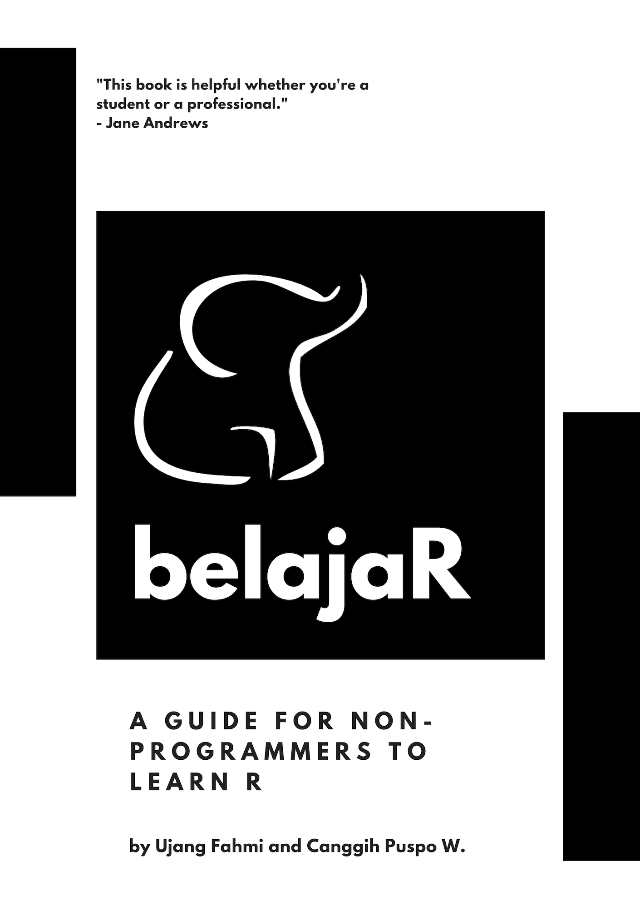

--- 
title: "belajaR"
subtitle: "Catatan belajar R untuk Akademisi Sosial"
author: "Ujang Fahmi"
date: "2018-10-13"
knit: "bookdown::render_book"
site: bookdown::bookdown_site
output: bookdown::gitbook
documentclass: book
bibliography: [book.bib, packages.bib]
biblio-style: apalike
link-citations: true
links-as-notes: true
colorlinks: true
github-repo: dgrtwo/tidy-text-mining
cover-image: images/cover.png
description: "Ini adalah sebuah catatan beberapa workshop yang saya sampaikan dalam beberapa kali pertemuan baik di kampus maupun di luar."
---

# Pengantar {-}

Lorem Ipsum is simply dummy text of the printing and typesetting industry. Lorem Ipsum has been the industry's standard dummy text ever since the 1500s, when an unknown printer took a galley of type and scrambled it to make a type specimen book. It has survived not only five centuries, but also the leap into electronic typesetting, remaining essentially unchanged. It was popularised in the 1960s with the release of Letraset sheets containing Lorem Ipsum passages, and more recently with desktop publishing software like Aldus PageMaker including versions of Lorem Ipsum. 

Contrary to popular belief, Lorem Ipsum is not simply random text. It has roots in a piece of classical Latin literature from 45 BC, making it over 2000 years old. Richard McClintock, a Latin professor at Hampden-Sydney College in Virginia, looked up one of the more obscure Latin words, consectetur, from a Lorem Ipsum passage, and going through the cites of the word in classical literature, discovered the undoubtable source. Lorem Ipsum comes from sections 1.10.32 and 1.10.33 of "de Finibus Bonorum et Malorum" (The Extremes of Good and Evil) by Cicero, written in 45 BC. This book is a treatise on the theory of ethics, very popular during the Renaissance. The first line of Lorem Ipsum, "Lorem ipsum dolor sit amet..", comes from a line in section 1.10.32.

This is the [website](http://tidytextmining.com/) for *Text Mining with R*! Visit the [GitHub repository for this site](https://github.com/dgrtwo/tidy-text-mining), find the book at [O'Reilly](http://www.jdoqocy.com/click-4428796-11290546?url=http%3A%2F%2Fshop.oreilly.com%2Fproduct%2F0636920067153.do%3Fcmp%3Daf-strata-books-video-product_cj_0636920067153_%25zp&cjsku=0636920067153), or [buy it on Amazon](http://amzn.to/2tZkmxG).

 This work by [Julia Silge](http://juliasilge.com/) and [David Robinson](http://varianceexplained.org/) is licensed under a <a rel="license" href="http://creativecommons.org/licenses/by-nc-sa/3.0/us/">Creative Commons Attribution-NonCommercial-ShareAlike 3.0 United States License</a>.

