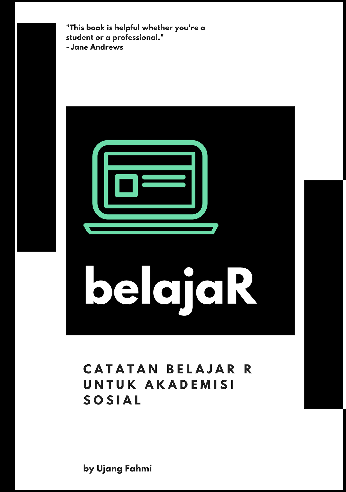

--- 
title: "belajaR"
subtitle: "A GUIDE FOR NON-PROGRAMMERS TO LEARN R"
author: "Ujang Fahmi"
date: "`r Sys.Date()`"
knit: "bookdown::render_book"
site: bookdown::bookdown_site
output: bookdown::gitbook
documentclass: book
bibliography: [book.bib, packages.bib]
biblio-style: apalike
link-citations: true
links-as-notes: true
colorlinks: true
github-repo: eppofahmi/belajaRBook
cover-image: images/cover.png
description: "Ini adalah sebuah catatan beberapa workshop yang saya sampaikan dalam beberapa kali pertemuan baik di kampus maupun di luar."
---

# Pengantar {-}



> "Learning these skills isn't just important for your future, it's important for our country's future." [- Barack Obama](https://www.youtube.com/watch?time_continue=13&v=6XvmhE1J9PY)

Quot di atas disampaikan oleh Barack Obama saat menjabat sebagai presiden Amerika untuk memotivasi anak muda untuk belajar ilmu komputer. Bagi kami hal ini cukup menarik karena di saat yang bersamaan Amerika sudah menjadi salah satu kiblat perkembangan teknologi dunia, namun pemimpinnya masih menekankan pentingnya belajar hal yang bagi sebagai orang dianggap teralalu sulit untuk dilakukan. Kalimat lain dari Obama yang membuat saya, sebagai orang yang tidak memiliki bekal dasar ilmu pemrograman dan matematika yang memadai adalah: *no one's born a computer scientist, but with a little hard work, and some math and science, just about anyone can become one.*

Pada awalnya, saya hanya ingin membuat sebuah penelitian sederhana dengan memanfaatkan data dari internet atau lebih tepatnya dari media sosial. Sebagaimana diketahui, saat ini kita berada di sebuah era di mana data ada dan bisa di dapat dari mana saja. Sayangnya, sebagian besar mahasiswa atau akademisi ilmu sosial tidak atau belum dibekali dengan kemampuan untuk memanfaatkannya data-data tersebut yang mau tidak mau harus berurusan dengan hal yang sering disebut *script* atau *code* dan bahasa pemrograman. Untuk mengatasi hal tersebut langkah sederhananya adalah minta bantuan teman atau bayar jasa. 

Namun jika anda seperti saya waktu itu, yang melihat langkah sederhana tersebut justru sulit, maka mungkin buku ini cocok untuk anda. Namun saya tidak dapat menjanjikan dengan membaca buku ini anda lantas bisa mahir bahasa pemrograman R, karena sebagian besar saya juga hanya belajar dari Youtube dan mengikuti kursus-kursus gratis yang banyak tersedia di internet. Dengan semangat berbagi, melalui buku ini saya ingin membagikan pengalaman mempelajari dan memanfaatkan bahasa pemrograman R baik dalam dunia akademis maupun untuk tujuan lain. Terkadang buat main-main dan mengisi waktu senggang. Untuk itu pula di sini saya mengajak teman sekaligus mentor saya **Canggih Puspo Wibowo** untuk ikut menulis, mengedit, dan memastikan apa yang saya tulis memenuhi standar minimal keilmuan yang sesuai. 

Di dalam buku ini saya tidak akan terlalu banyak menjelaskan sisi teknis atau matematika. Tapi hal tersebut bukan berarti tidak penting, bahkan untuk akademisi sosial. Di sini kami akan lebih banyak fokus pada pemanfaatan alat-alat yang sudah ada dalam bahasa pemrograman untuk menjawab pertanyaan akademis, maupun pertanyaan lain yang sifatnya hanya rasa keingintahuan penulis. 

Dengan segala keterbatasanya, kami ucapkan selamat membaca, dan semoga bermanfaat.

This is the [website](https://github.com/eppofahmi/belajaRBook) for *belajaR*! Visit the [GitHub repository for this site](https://github.com/eppofahmi/belajaRBook), find the book at  [O'Reilly](http://www.jdoqocy.com/click-4428796-11290546?url=http%3A%2F%2Fshop.oreilly.com%2Fproduct%2F0636920067153.do%3Fcmp%3Daf-strata-books-video-product_cj_0636920067153_%25zp&cjsku=0636920067153), or [buy it on Amazon](http://amzn.to/2tZkmxG).

<a rel="license" href="http://creativecommons.org/licenses/by-nc-sa/3.0/us/"></a><br />This work by [Ujang Fahmi](https://github.com/eppofahmi) and [Canggih Puspo W](https://github.com/canggihpw) is licensed under a <a rel="license" href="http://creativecommons.org/licenses/by-nc-sa/3.0/us/">Creative Commons Attribution-NonCommercial-ShareAlike 3.0 United States License</a>.

```{r include=FALSE}
# automatically create a bib database for R packages
knitr::write_bib(c(
  .packages(), 'bookdown', 'knitr', 'rmarkdown', 'rmallet'
), 'packages.bib')
```
